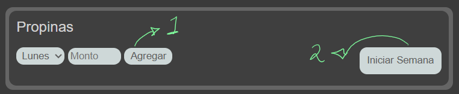
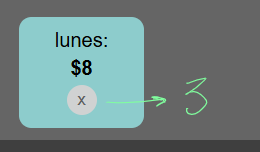
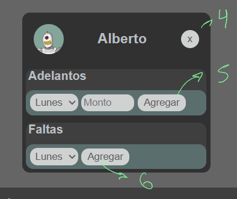
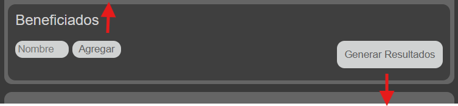

# Calculador de Propinas

El programa permitira al usuario agregar la propina diaria y entre quienes sera repartida asi como calcular el total a entregar, permitira registrar los adelantos y los dias que falto algun trabajador, asi como la opcion de seleccionar a quien fue hecha la entrega de la misma

[Acceda al Calculador aqui](https://lacruzjd.github.io/calculadorPropinas-ch/)

## Instrucciones de uso:

1- Agregar propina diaria

2- Iniciar nueva semana, elimina todos los datos ingresados, propinas, adelantos, dias faltantes y resultados

3- Boton para eliminar propina.

4- Boton para Eliminar Benefiado

5- Agrega Adelantos

6- Agrega dias faltantes

7- Boton para agregar benefiado

8- Boton para generar los totales

9- Selector para indicar que propina fue entregada
