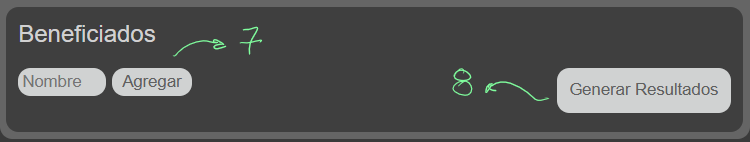
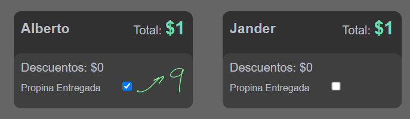

# Calculador de Propinas

El programa permitira al usuario agregar la propina diaria y entre quienes sera repartida asi como calcular el total a entregar, permitira registrar los adelantos y los dias que falto algun trabajador, asi como la opcion de seleccionar a quien fue hecha la entrega de la misma

[Acceda al Calculador aqui](https://lacruzjd.github.io/calculadorPropinas-ch/)

## Instrucciones de uso:

Agregar propina diaria

Iniciar nueva semana limpia todos los datos ingresados, propinas, adelantos, dias faltantes y resultados

 
Boton para eliminar propina.

Boton para Eliminar Benefiado

    Agregar Adelantos
     
    Eliminar item

Agregar dias faltantes

Boton para agregar benefiado

Boton para generar los totales 

 

Selector para indicar que propina fue entregada

